# 自动发现机制说明

本文说明平台“零配置自动发现”的工作原理：在用户**不预先定义任何字段/规则**的
前提下，系统如何从上传文献中自动发现**候选字段**与**候选关键词（术语）**，
以及大模型（DeepSeek）在其中的边界与断网降级策略。目标读者为客户技术评审人员。

实现位置：`app/services/term.py`（`TermService`）、API `app/api/v1/terms.py`、
异步任务 `app/worker.py`。数值抽取的正则来自 `app/services/extraction.py`。

---

## 1. 设计原则

- **零配置**：文献解析后无需人工先写 schema，系统自动扫描候选。
- **用户确认闭环**：自动发现只产出“候选”，是否采用由用户一键确认。
- **规则产数值、大模型只命名**：所有数值、单位、证据均由确定性规则从原文得到；
  大模型仅用于“把名字规范化、归类、提同义建议”，**严禁编造或推断任何数值**。
- **可降级**：无 API Key 或调用失败时，自动退回纯规则，不阻断流程。
- **可追溯**：每个候选保留出现频次、跨文献篇数与原文证据示例。

---

## 2. 字段自动发现

**触发**：`POST /projects/{id}/field-discovery` → 异步任务 `discover_fields`
（`term.py` 的 `discover_fields`）。可选传 `search_run_id` 只在检索命中的范围内发现。

### 2.1 语料收集
取项目内每篇文献的**最新版本**，从解析结果中汇集：
- `document_blocks` 正文段落文本；
- `document_table_cells` 表格：表头单元格单独收集，其余按“表头: 值”拼接；
- `document_figures` 图表标题/说明。

### 2.2 三路候选信号

1. **数值短语模式（正则）**：匹配“短语 + 数字 + 可选单位”的写法，如
   `发酵温度 30 ℃`、`含水率 12.5 %`。短语再经 jieba 切词提炼为有意义的
   1–2 个词。命中即记为数值型候选，并统计单位与命中次数、保存原文片段。
2. **表格表头**：直接把表头文本作为候选字段（往往是最规范的字段名）。
3. **高频专业词**：对正文用 jieba 分词，过滤停用词与纯符号数字后按词频统计，
   高频词作为候选。

同一字段的不同写法按**归一化 key**（去空白、casefold）合并为一条，并把其它
写法收集为**别名（aliases）**。

### 2.3 过滤与排序
- 过滤：跨文献篇数需达到下限（`min_documents`）。
- 排序：文献篇数 → 出现次数 → 是否来自表头/是否带单位。
- 截断：最多保留 `max_candidates`（默认 200）条。

### 2.4 可选：大模型命名与归类
若配置了 DeepSeek Key 且 `use_llm=True`，将候选（名称 + 是否有单位 + 一条示例）
交给大模型，仅返回：
- `standard_name`（规范名）
- `category`（固定 6 类：工艺参数/化学指标/感官评价/微生物/元数据/其他）
- `role`（固定 4 类：feature/target/identifier/metadata）

大模型**不接触也不产出数值**。调用会记入 `external_calls` 审计表。

### 2.5 候选输出
每条候选（存为 `terms` 表 `status=candidate`）在列表接口
`GET .../field-candidates` 暴露：显示名、类别、建议单位、出现次数、跨文献篇数、
置信度、最多 5 条原文示例、别名。数据类型按“是否有单位/数值占比”判定为
`number` 或 `text`。**此时还没有 `field_key`**，它在用户建方案时指定。

---

## 3. 关键词/术语发现

**触发**：`POST /projects/{id}/term-discovery`（必须提供 `search_run_id`）→
异步任务，`TermService.discover`。

算法为**纯规则、不使用大模型**：
1. 读取检索命中结果（`is_included=True`）的上下文（命中词及前后文）；
2. jieba 分词 + 停用词过滤后按词频统计；
3. 词频达到 `min_occurrences`、取前 `max_candidates` 作为候选术语；
4. 写入 `terms`（候选），出现位置写入 `term_occurrences`
   （方法标注为 `frequency_discovery`）。

---

## 4. 同义聚类与合并建议

同义**建议**接口 `GET .../terms/synonym-suggestions`（`suggest_synonyms`）：
- 为每个术语构建变体集合（规范名、归一名、别名）；
- 两两比较：变体有交集记 100 分，否则用 **RapidFuzz `token_set_ratio`** 取最高分；
- 相似度 ≥ 85 的归为一簇（并查集），每簇选出现频次最高者为“建议标准词”。

该接口**只读、不改数据**。是否真正合并由用户手动执行
`POST .../terms/merge`。字段发现阶段本身只做别名收集，不自动合并不同 key。

---

## 5. 大模型边界与降级

| 环节 | 是否用大模型 | 说明 |
|------|-------------|------|
| 字段发现命名/归类 | 可选 | 仅产出 standard_name/category/role |
| 术语发现 | 否 | 纯 jieba 词频 |
| 同义建议 | 否 | 纯 RapidFuzz |
| 数值/单位/证据 | **绝不** | 全部由正则/分词从原文得到 |

**降级触发**：未配置 Key、HTTP 异常、或返回 JSON 解析失败时，
`_llm_field_annotations` 返回空，流程自动回退：`used_llm=False`，规范名回退为
规则识别的显示名，类别回退为默认领域术语，角色回退为 `feature`。
（测试 `test_discover_fields_use_llm_true_without_key_falls_back` 佐证：无 Key
时不会发起网络调用。）

---

## 6. 用户确认闭环 → 进入抽取

```mermaid
flowchart LR
  A[上传并解析文献] --> B[POST field-discovery]
  B --> C[任务 discover_fields]
  C --> D[GET field-candidates 审阅]
  D --> E[合并/拆分/微调/确认]
  E --> F[field-schemas/from-candidates 生成方案]
  F --> G[field-schemas/&#123;id&#125;/freeze 冻结]
  G --> H[extraction-runs 抽取]
  H --> I[核对证据 -> 构建并冻结数据集]
```

关键约束：
- **必须冻结字段方案**才能创建抽取（`field_schema_not_frozen` 硬校验）。
- 从候选生成方案时会把别名写入字段的抽取配置，并把相关候选术语标记为
  `confirmed / is_selected`。
- 抽取阶段按字段显示名 + 别名，用 `VALUE_PATTERN`/`UNIT_PATTERN` 从**原文**
  匹配数值并保留证据，不读取大模型输出。

---

## 7. 依赖与实现要点

| 库 | 用途 |
|----|------|
| jieba | 中文分词（术语发现、数值短语提炼） |
| RapidFuzz | 同义建议相似度（token_set_ratio） |
| 正则（VALUE/UNIT_PATTERN） | 数值字段模式与单位识别 |
| httpx + DeepSeek | 可选的字段命名/归类（可降级） |

**一句话总结**：三路规则信号发现候选 → 归一聚合并收集别名 → 可选大模型仅做
命名与归类 → 用户确认并冻结方案 → 规则从原文抽取数值。整个过程中数值始终
来自原文、可追溯，大模型不越界产出数值。
